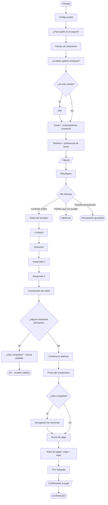

# Prompt · Diagrama de flujo del funnel FIATC Salud (para el agente de Figma / FigJam)

> **Fuente de verdad**: la lógica condicional sale de `ux/SPECS.md`; las pantallas y su
> porqué, de `ux/FUNCIONAL.md`. Si alguna vez discrepan de este prompt, mandan ellos.
>
> **Ojo con una trampa**: el diagrama refleja el comportamiento **decidido**, no lo que el
> prototipo implementa. En el camino KO el prototipo simplifica a propósito (`SPECS.md` F-05),
> así que **no "corrijas" el diagrama mirando el HTML**.

## Instrucción para el agente

Crea un **diagrama de flujo de usuario (user flow)** del funnel de contratación de seguro de salud descrito abajo, en **FigJam**.

Convenciones visuales:
- **Rectángulo** = pantalla/paso.
- **Rombo (diamante)** = punto de decisión / bifurcación (pregunta con ramas).
- **Paralelogramo** = pantalla de espera (loading).
- **Rectángulo redondeado / píldora** = inicio y finales (terminales).
- **Flechas** con etiqueta cuando la transición depende de una respuesta (p. ej. "Sí" / "No").
- Agrupa en **4 carriles o secciones** con títulos: `Tarificación`, `Resultados`, `Contratación`, `Flujos laterales`.
- Marca en un color distinto los **finales alternativos** (KO, guardar presupuesto, Hablemos) frente al **final feliz** (Confirmación).
- Flujo de arriba abajo (vertical) o izquierda a derecha, el que quede más limpio.

Usa exactamente los nombres de pantalla y las etiquetas de rama de la sección "Esquema de pasos".

**Una pantalla aparece dos veces a propósito**: `cOtra` ("¿Tienes seguro con otra compañía?") se visita en el camino normal y también en el camino KO, en momentos distintos. Dibújala **duplicada**, una en cada rama, y añade una nota indicando que es la misma pantalla.

---

## Esquema de pasos

### 1) Tarificación (lineal, con 1 rama)
1. **Portada** (`step0`) → Calcula tu precio
2. **Código postal** (`stepCP`) — si el CP tiene varias localidades, aparece un selector de zona
3. **¿Para quién es el seguro?** (`step1`) — tú / tú + otros / otros sin incluirte
4. **Fechas de nacimiento** (`step2`) — una por asegurado, se pueden añadir y quitar
5. **¿Cuándo quieres empezar?** (`step4`) — fecha de inicio de cobertura
6. ◆ **DECISIÓN: ¿Ya eres cliente de FIATC?** (`step5`)
   - **Sí** → **DNI** (`stepDNI`) → continúa
   - **No** → continúa directo
7. **Email + consentimiento comercial** (`step6`) — opt-in de publicidad, **solo canal email**, con texto legal
8. **Teléfono + preferencia de canal** (`step6b`) — *"¿Prefieres por WhatsApp?"*, para hablar de tu solicitud. **No es publicidad** y no lleva texto legal
9. ▱ **Cálculo** (loading, ~4 s) → Resultados

> Los dos permisos de los pasos 7 y 8 son **de naturaleza distinta y van separados a
> propósito**. No etiquetarlos igual ni juntarlos en una sola caja: si se leen como hermanos,
> nadie entiende la diferencia.

### 2) Resultados
10. **Resultados / comparador de planes** (`step7`)
    - Acciones secundarias (no avanzan el flujo): **Detalles del plan**, **Recalcular** (cambiar asegurados y CP), **FAQs**, **Guardar presupuesto**.
11. ◆ **DECISIÓN: "Me interesa"** (modal, `#interesModal`) — 3 salidas:
    - **Contratar online ahora** → entra en **Contratación** (paso 12)
    - **Prefiero que me ayuden** → *[final lateral]* **Hablemos**
    - **Guardar presupuesto** → *[final lateral]* **Presupuesto guardado** (captura email + consentimiento comercial)

### 3) Contratación (con 2 ramas + 1 rama terminal)
12. **Datos del tomador** (`cDatos`)
13. **Contacto** (`cContacto`) — confirmación de email y teléfono
14. **Dirección** (`cDireccion`)
15. **Asegurado 1** (`cAseg1`)
16. **Asegurado 2** (`cAseg2`) *(condicional: uno por asegurado; la media real es de 2 personas por cotización)*
17. **Cuestionario de salud** (`cCuestionario`) — 8 preguntas **por asegurado**, en modal
18. ◆ **DECISIÓN: ¿Alguna respuesta "Sí" en el cuestionario?**
    - **Sí (hay declaración)** → **¿Tienes seguro con otra compañía?** (`cOtra`, *misma pantalla que el paso 21*) → *[rama terminal]* **KO – Un médico revisará tu solicitud** (`cKO`)
      - Se sigue preguntando la portabilidad porque es un dato que interesa igualmente, y **va al KO responda lo que responda**.
      - **El camino KO se salta `cTelefono` y `cFirma`**: no se firma nada mientras la solicitud está pendiente de revisión médica.
      - `cKO` es terminal. *Salidas: volver a resultados / Hablemos.*
    - **No (todo "No")** → continúa al paso 19
19. **Confirma tu teléfono** (`cTelefono`) — para firmar online (PIN por SMS)
20. **Firma del cuestionario** (`cFirma`) — pantalla de firma (Evicertia, simulada). *Es la firma de la declaración de salud, no la del contrato*
21. ◆ **DECISIÓN: ¿Tienes seguro con otra compañía?** (`cOtra`)
    - **Sí** → **Derogación de carencias** (`cDerogacion`): subida **opcional** de documentos, se pueden enviar más tarde por email → continúa
    - **No** → continúa directo
22. **Forma de pago** (`cPago`) — mensual / trimestral / semestral / anual
23. **Antes de continuar con el pago** (`cAntes`) — resumen del cargo + condiciones legales
24. **Pasarela de pago TPV** (`cTPV`) — iframe Banco Sabadell (simulado)
25. ▱ **Estamos confirmando tu pago** (loading, ~5 s)
26. ⬤ **Confirmación** (`cConfirm`) *[final feliz]*
    - El título celebra el alta y da número de póliza; el subtítulo condiciona: *"En cuanto firmes el contrato, la cobertura empieza el…"*.
    - Stepper de lo que queda:
      1. Tu seguro de salud ya está contratado — *hecho*
      2. **Firma tu contrato para poder usar tu seguro** — `Pendiente` · 2ª firma, llega por email
      3. **Envíanos la documentación pendiente** — `Pendiente` · **solo si viene de otra compañía**
      4. Descarga la app de FIATC — *sin tag, es opcional*
    - **La 2ª firma es lo que activa la cobertura**, no la app.

### 4) Flujos laterales (accesibles desde varios pasos)
- **Hablemos** (contacto): canales · **agendar llamada** · confirmación. Al agendar se piden email, teléfono y **franja horaria** — 5 franjas en chips: `10h a 12h` · `12h a 14h` · `14h a 16h` · `16h a 18h` · `18h a 20h`. Accesible desde la cabecera en todo el funnel, y como salida de "Me interesa" y del KO.
- **Exit-intent** (al pulsar el logo): "¿Seguro que quieres salir?" → opción **Guardar presupuesto** (captura email) → Presupuesto guardado. *Solo ofrece guardar si ya se ha visto el precio.*
- **Recuperar presupuesto** (desde Portada): email → aterriza directo en Resultados.
- **Modales de apoyo** (no son pasos del flujo): resumen persistente, detalles del plan, recalcular, FAQs por contexto, descargar app (QR en desktop / store en mobile).

---

## Resumen de las ramificaciones (para el diagrama)

| # | Decisión | Rama A | Rama B |
|---|----------|--------|--------|
| 1 | ¿Ya eres cliente? (`step5`) | Sí → DNI → Email | No → Email |
| 2 | "Me interesa" (resultados) | Contratar online → Contratación | Hablemos / Guardar presupuesto → finales laterales |
| 3 | ¿"Sí" en cuestionario? (`cCuestionario`) | Sí → `cOtra` → **KO** (rama terminal, sin firma) | No → Confirma teléfono → Firma → … |
| 4 | ¿Otra compañía? (`cOtra`) | Sí → Derogación → Pago | No → Pago |

## Finales del flujo
- ⬤ **Confirmación** (`cConfirm`) — final feliz. Quedan pendientes la 2ª firma y, si aplica, la documentación.
- **KO / revisión médica** (`cKO`) — no contrata online; espera la llamada.
- **Hablemos** — deriva a asesor.
- **Presupuesto guardado** — retención para volver más tarde.

---

## (Opcional) Diagrama en Mermaid — por si el agente lo aprovecha

